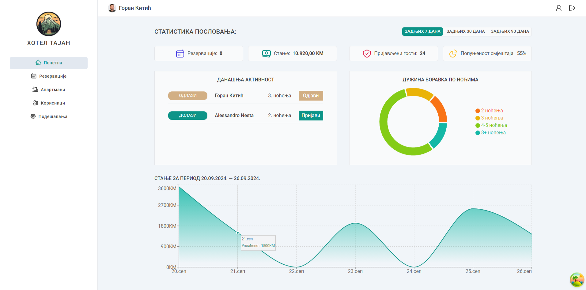
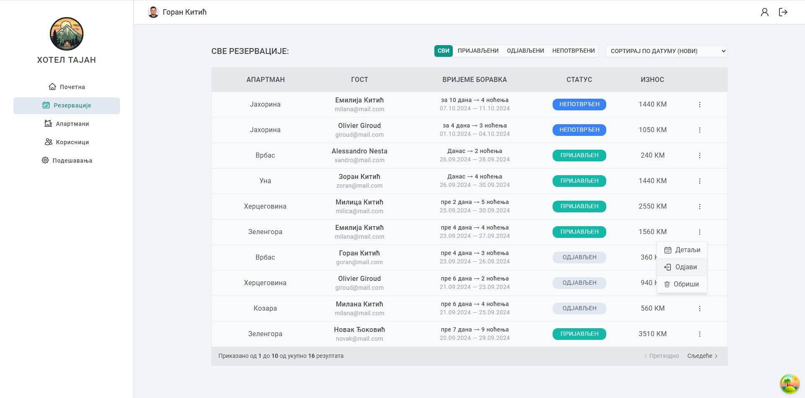

# 🌲 Hotel Tajan management system

HTMS is a student project and a simple full-stack application created while learning MERN stack technologies, React, Node.js, Express, MongoDB, and exploring libraries like React Router, Tanstack (React Query), Recharts, and more. 
HTMS is an internal hotel management system for hotel employees to track bookings, check-in, and check-out guests, and manage apartments.

⌨️ Practicing: Creating reusable filter, sort, pagination, modal, select, context menu, and table components using the compound component pattern. Fetching data, error handling, creating custom hooks...

©️ 2024 Goran Kitic

